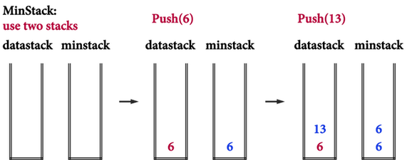
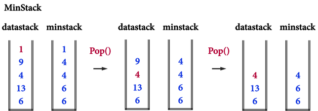

# O(1) 取最小值

> got this Subject from the chatting with Nil

## 见图知意

> Push  

> Pop  

如图, 从ministack中,取顶部的值, 即最小值. 时间复杂度为 O(1)

push操作, 多执行一步与miniStack顶层值的比较. push 复杂度亦为 O(1)

## 参考链接

[能夠在O(1)取得最小值的MinStack](https://alrightchiu.github.io/SecondRound/stack-neng-gou-zai-o1qu-de-zui-xiao-zhi-de-minstack.html)