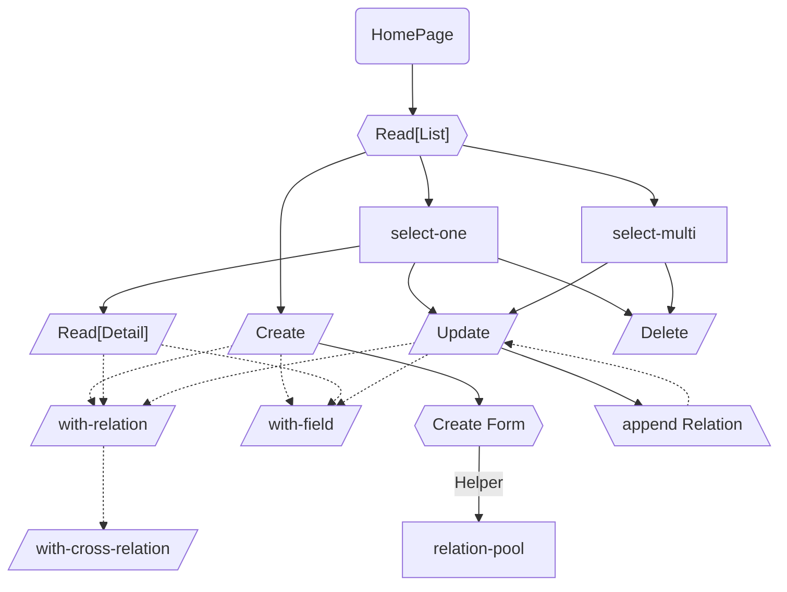

# Headless API

```mermaid
graph TB
    classDef className fill:#f9f,stroke:#333,stroke-width:4px;

    c[/Create/]

    c-f{{Create Form}}

    o-f[/with-field/]
    o-r[/with-relation/]
    o-rr[/with-cross-relation/]

    r-l{{"Read[List]"}}
    r-d[/"Read[Detail]"/]

    u[/Update/]
    u-a[\append Relation\]
    d[/Delete/]
    s1[select-one]
    s-m[select-multi]
    st(HomePage)

    c-f-->|Helper|relation-pool
    o-r-.->o-rr

    c-->c-f

    c-.->o-f
    c-.->o-r
    r-d-.->o-f
    r-d-.->o-r
    u-->u-a-.->u
    u-.->o-r
    u-.->o-f

    st-->r-l
    r-l-->s1
    r-l-->s-m
    r-l-->c

    s1-->r-d
    s1-->u
    s1-->d
    s-m-->u
    s-m-->d

```
